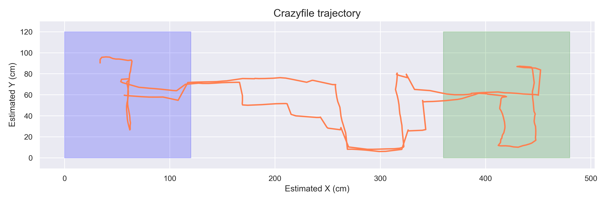

# CrazyPracticals (21 Spring)

> Members: Yujie He, Jianhao Zheng, and Longlai Qiu

## Goal

<p align="center"></p>
In this practical, we programed based on [Crazyflie  2.1](https://www.bitcraze.io/products/crazyflie-2-1/) to find and precisely land on a platform with height of 10 cm by utilizing z reading from [flow deck](https://www.bitcraze.io/products/flow-deck-v2/). Additionally, We also utilized sensor readings from [multi-ranger deck](https://www.bitcraze.io/products/multi-ranger-deck/) to avoid the obstacles presented in the environment.


## Pipeline

| Autonomous navigation & landing                              | Workflow                                                     |
| ------------------------------------------------------------ | ------------------------------------------------------------ |
| ✓local obstacle avoidance<br />✓grid-based coverage path planning<br />✓waypoint following<br />✓A* search-based re-planning |  |


## Demo

- `overall.py`: overall pipeline from taking off to landing.

  ```shell
  # -x (float) for setting initial x position
  # -y (float) for setting initial y position
  # -v (bool) for enabling visualization
  python overall.py -x 0.6 -y 0.6 -v
  ```

  🚧 add gif for live plotter

- `draw_traj.py`: x-y trajectory visualization with region annotation

  ```shell
  # --log_folder (str) for assigning input log folder
  # --logname (str) for loding log file
  # --img_folder (str) for assigning output image folder
  # -n/--name (str) for assigning output image name
  # --zone_anno (bool) for enabling region annotation
  python draw_traj_demo.py --logname overall-20210530_1930 -n cf_demo --zone_anno
  ```
<p align="center">
  
</p>

  - The estimated values drift considerably after long flights.
  - After the drone re-takes off, the predicted starting position is significantly different from the starting point.


## Experimental setup

| Features                                                     | Figures                                                      |
| ------------------------------------------------------------ | ------------------------------------------------------------ |
| ✓Size: 480 cm (W) × 120 cm (H)<br/>✓Starting & Landing pad<br/>  - starting (x, y) = (60 cm, 60 cm)<br/>  - landing pad randomly placed<br/>✓Circular and rectangular obstacles |  |


## Features

- Modular library for different tasks

  ```
  ├── cf_load_params.py  # parameter setting
  ├── cf_search.py       # searching functions such as, coverage planning, box edge detection, A* search
  ├── cf_state_class.py  # state estimation class for the proposed task
  └── cf_utilis.py       # utility functions, such as live plotting
  ```

- Utilized `argparse` for quick parameter adjustment and tuning

- Utilized `matplotlib` for real-time visualization


## Acknowledgement

Thanks to Prof. Dario Floreano and TAs from LIS at EPFL for these amazing tutorials and examples!
